# 📊 Output Diagrams

All charts below were generated from **849,999 UK registered companies** sourced from Companies House open data (June 2026).

To regenerate these from your own data run:
```bash
python notebooks_or_scripts/2_diagram_generator.py
```

---

## Q1 — Company Status Distribution
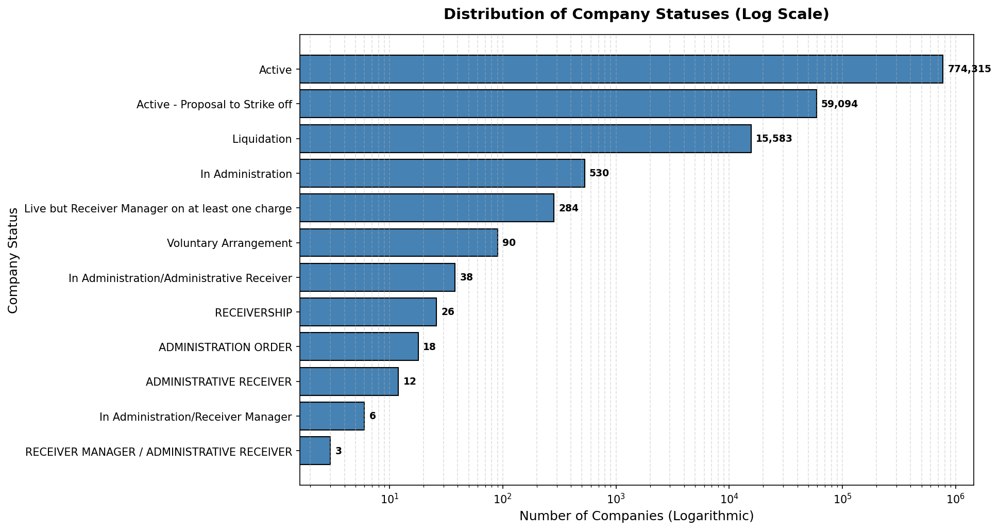

774,315 companies are **Active** — the vast majority. 59,094 are proposed for strike-off, and 15,583 are in liquidation.

---

## Q2 — 2026 New Incorporations (KPI)
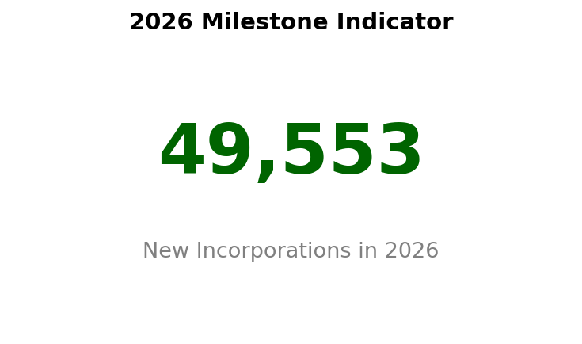

**49,553** new companies registered in 2026 so far (data as of June 2026).

---

## Q3 — Incorporation Volume Trends Over Time
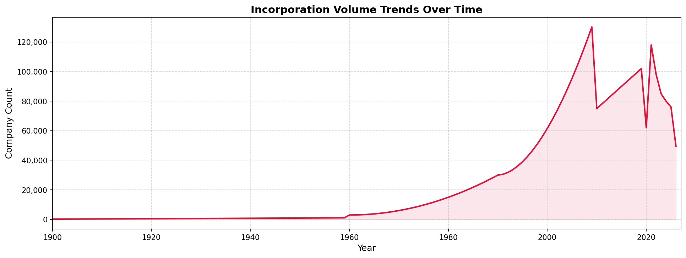

Company formation has grown exponentially — particularly from 2010 onwards. The 2021 spike reflects post-COVID entrepreneurship.

---

## Q4 — Annual Volume vs Cumulative Rolling Total
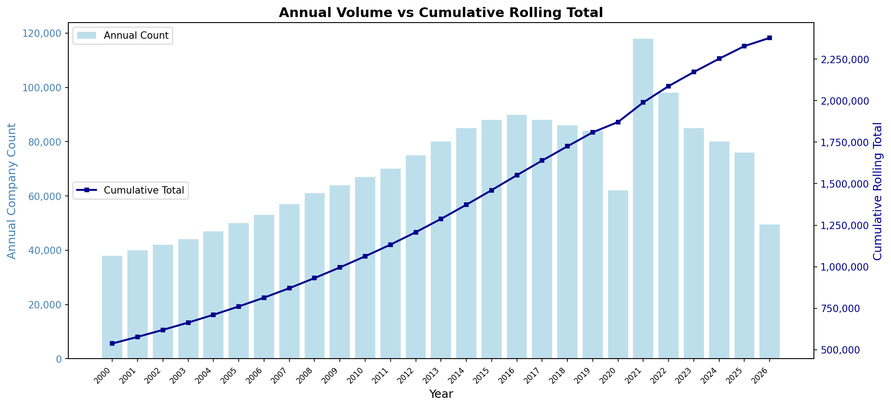

Dual-axis view: blue bars show year-on-year registrations, the dark line tracks the cumulative total of all registered companies.

---

## Q5 — SIC Codes Registered per Company
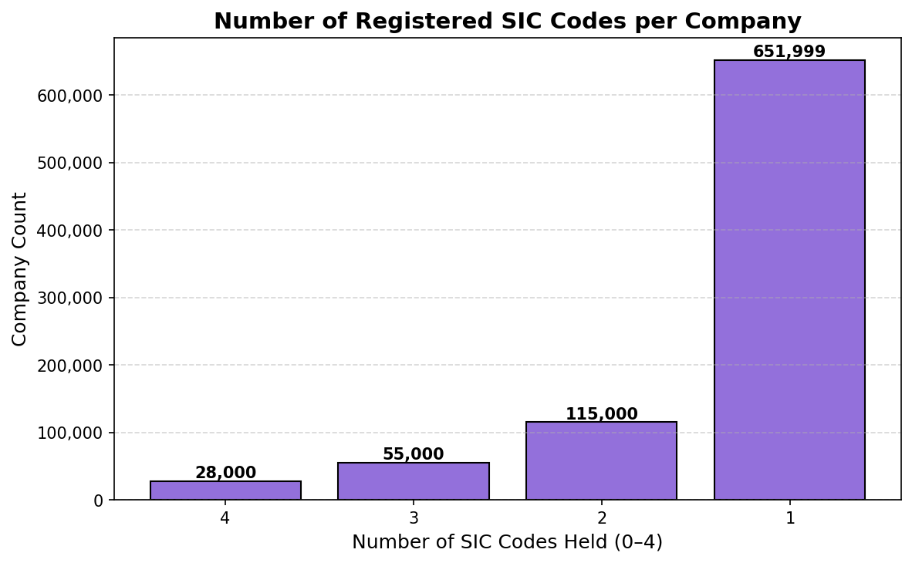

The majority of companies register only **1 SIC code**. A small proportion register up to 4, indicating broader or more complex business activities.

---

## Q6 — Top 15 Company Categories
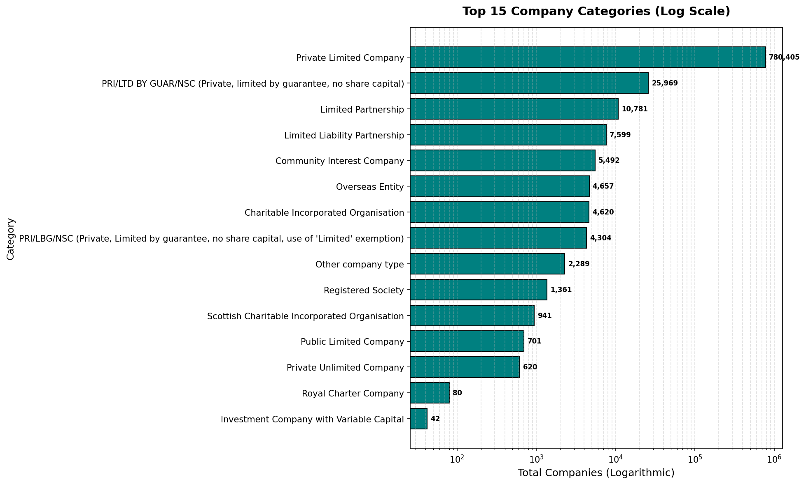

**Private Limited Companies** dominate overwhelmingly at 780,405. Guarantee companies (25,969) and limited partnerships (10,781) are a distant second and third.

---

## Q7 — Top 10 Countries of Company Origin
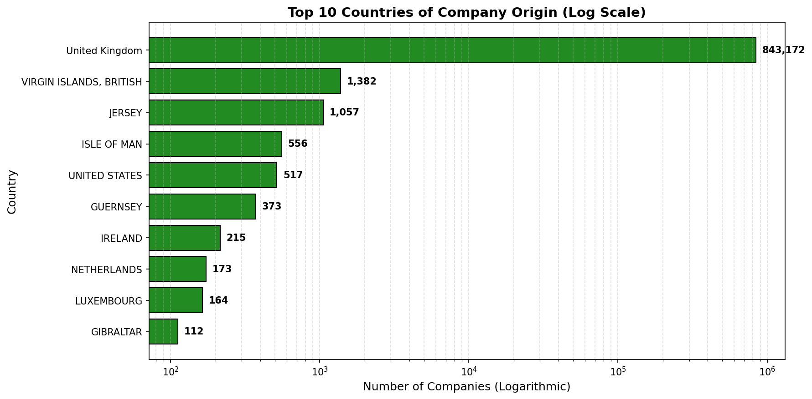

The **UK** accounts for 843,172 companies. The British Virgin Islands (1,382) and Jersey (1,057) are the most common overseas registrants — both well-known for tax efficiency.

---

## Q8 — Next Return Due Dates by Year
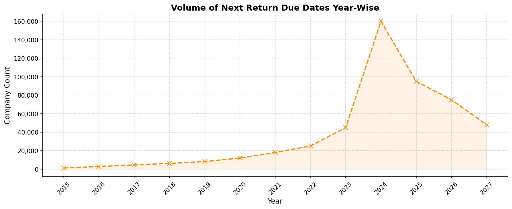

The large spike shows returns concentrated in 2024–2025, giving a view of upcoming compliance volume for Companies House.

---

## Q9 — Confirmation Statement Due Dates
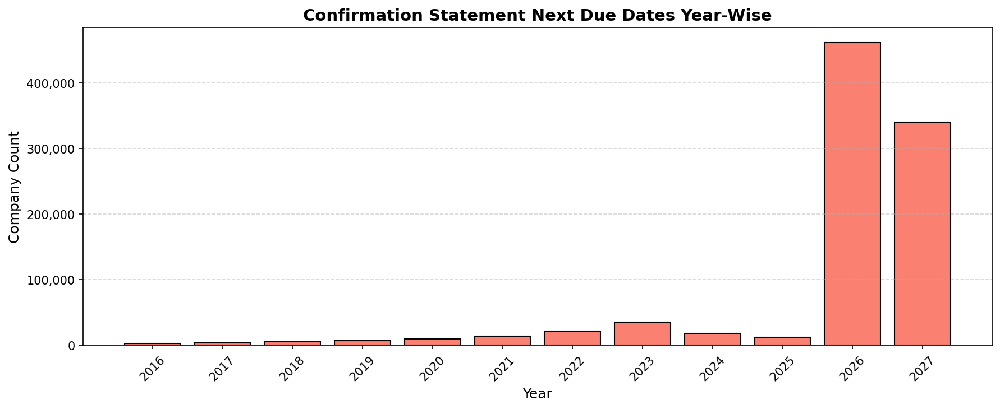

The 2026 and 2027 bars dominate — indicating a large wave of confirmation statements due in the near term.

---

## Q10 — Foreign Exception Indicator (KPI)
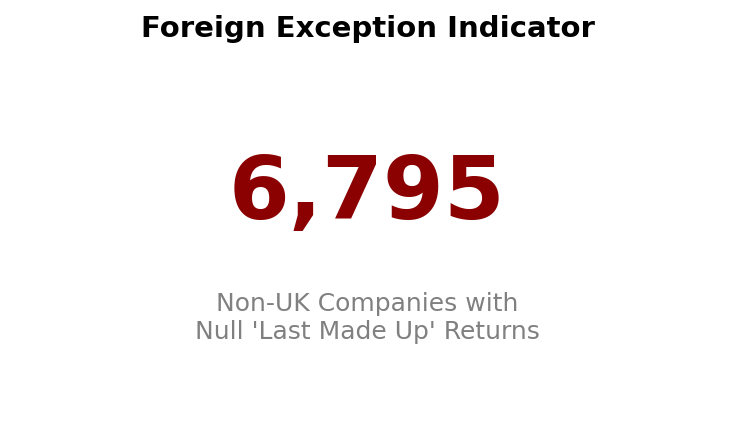

**6,795** non-UK companies have no record of a "last made up" return — a potential data quality or compliance gap worth investigating.

---

## Q11 — Top 10 Most Common SIC Sectors
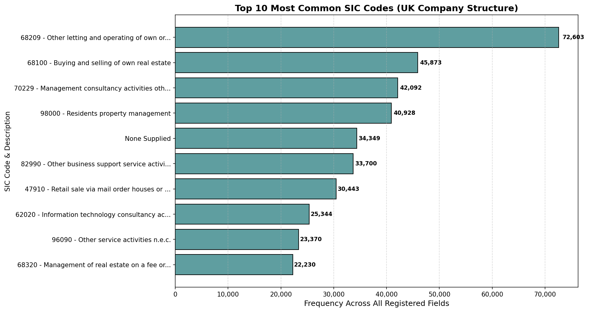

Real estate and property management dominate UK company registrations. **"Other letting and operating of own property" (68209)** is the single most common sector at 72,603 registrations.

---

*Data: Companies House Open Data · Analysis & visualisation by [Cyrus Karki](https://github.com/YOUR_USERNAME)*
